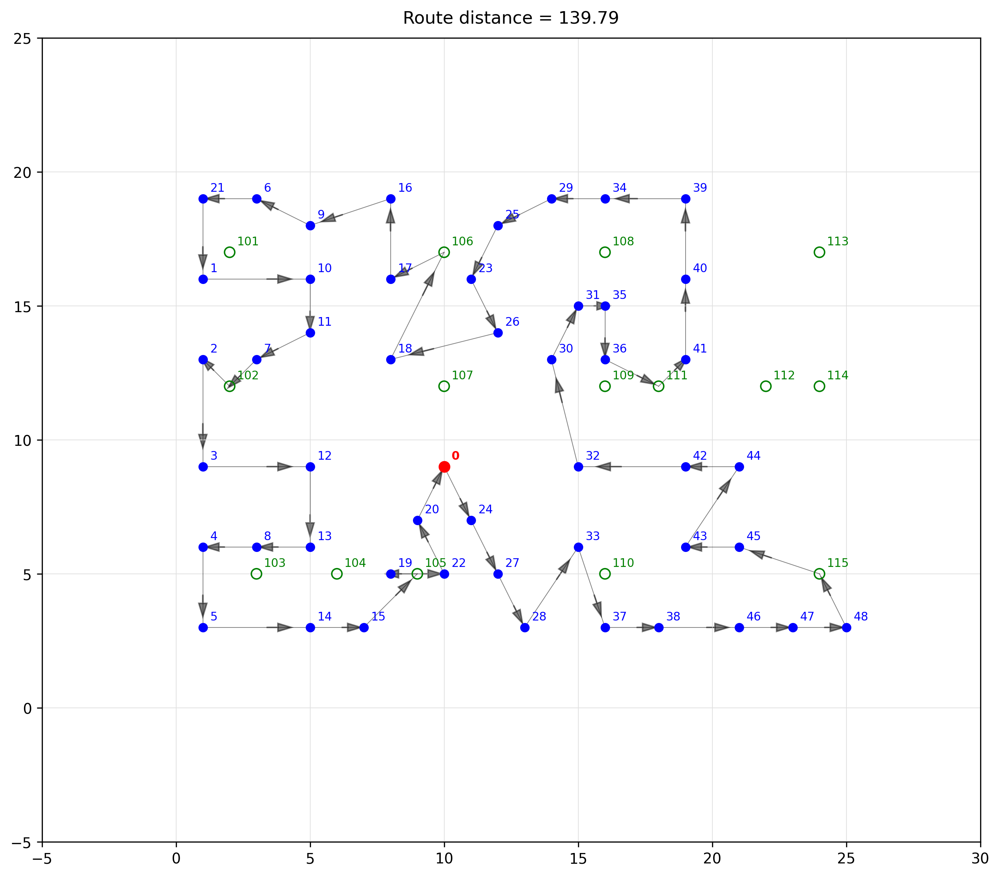

<h1>🚚 Delivery Route Optimizer on 2D plane</h1>

This project is a delivery route optimization system designed to find efficient routes that minimize total travel distance. It considers delivery locations, a central depot, and petrol station stops. The algorithm combines greedy randomized construction, local search (2-opt), and a smart refueling stop insertion strategy.

<h2>🧠 How It Works</h2>

<h3>Overview</h3>
<ol>
  <li><strong>Data Loading</strong> Reads delivery, depot, and petrol station data from a CSV file (<code>data.csv</code>).</li>
  <li><strong>Distance Precomputation</strong> Calculates and caches the Euclidean distances between all relevant points (depot, delivery stops, and petrol stations).</li>
  <li><strong>Initial Solution Generation</strong> Generates multiple (default: 50) randomized routes using a <strong>greedy randomized nearest-neighbor</strong> heuristic.</li>
  <li><strong>Local Search Optimization (2-opt)</strong> Improves each route using the <strong>2-opt local search algorithm</strong>, which iteratively removes crossing paths to reduce total distance.</li>
  <li><strong>Refueling Stop Optimization</strong> Inserts petrol stations into the route between delivery segments using a detour-minimizing strategy across multiple grouping patterns.</li>
  <li><strong>Visualization</strong> Saves a plotted map of the route as a PNG (<code>route_map.png</code>).</li>
</ol>

<h2>🔍 Algorithm Details</h2>

<h3>1. Greedy Randomized Construction</h3>

Start from the depot. While there are unvisited delivery points:
<ul>
  <li>Choose the top 10 nearest unvisited stops.</li>
  <li>Randomly pick one from these 10 to add to the route.</li>
</ul>
Return to the depot to close the loop. This technique ensures a diverse set of reasonably good starting solutions.

<h3>2. 2-Opt Local Search</h3>

Each route is improved by repeatedly applying <strong>2-opt swaps</strong>:
<ul>
  <li>Select two indices <code>i</code> and <code>j</code> in the route.</li>
  <li>Reverse the subroute between them.</li>
  <li>If this reduces the total distance, accept the change.</li>
</ul>
This is repeated for up to <code>max_iterations</code> (default: 10,000 for initial optimization; 20,000 for refinement).

<h3>3. Refueling Stop Insertion</h3>

After finding the best delivery-only route:
<ul>
  <li>The optimizer tests 5 different delivery group patterns (e.g., <code>[8, 9, 9, 9, 9, 4]</code>).</li>
  <li>For each group boundary, it inserts the <strong>best petrol station</strong> (minimizing extra distance).</li>
  <li>The total distance of the resulting route is calculated, and the best version is selected.</li>
</ul>

<h3>4. Visualization</h3>

The final route is visualized with:
<ul>
  <li>Red dot for the <strong>Depot</strong> (<code>Stop-ID == 0</code>)</li>
  <li>Blue dots for <strong>Deliveries</strong> (<code>1 <= Stop-ID <= 48</code>)</li>
  <li>Green-circled markers for <strong>Petrol Stations</strong> (<code>Stop-ID >= 101</code>)</li>
  <li>Arrows indicating direction of travel</li>
</ul>
The image is saved as <code>route_map.png</code>.

<h2>📁 Input Format</h2>

Input should be in a CSV file named <code>data.csv</code> with at least the following columns:
<ul>
  <li><code>Stop-ID</code>: Integer ID (Depot = 0, Delivery Stops = 1–48, Petrol Stations >= 101)</li>
  <li><code>X</code>, <code>Y</code>: Coordinates (float or integer)</li>
</ul>

<h2>🛠️ Installation & Usage</h2>

<h3>1. Install dependencies:</h3>
<pre><code>pip install pandas numpy matplotlib</code></pre>

<h3>2. Place <code>data.csv</code> in the same directory as <code>project.py</code>.</h3>

<h3>3. Run the script:</h3>
<pre><code>python project.py</code></pre>

<h2>🧾 Output</h2>

Route log in the terminal including:

<ul>
  <li>Stop-by-stop path</li>
  <li>Distance between each pair</li>
  <li>Total distance</li>
  <li>Count of delivery and petrol stops</li>
</ul>

Visualization saved to <code>route_map.png</code>

<h2>📦 Project Structure</h2>
<pre><code>.
├── project.py               # Main script containing the optimizer logic
├── data.csv               # Input CSV file with stop data
├── route_map.png          # Output route visualization
</code></pre>

<h2>🧠 Techniques Used</h2>
<ul>
  <li>Greedy randomized heuristic</li>
  <li>2-opt local search (TSP-style improvement)</li>
  <li>Multiple grouping evaluation for refueling strategies</li>
  <li>Distance memoization for performance</li>
  <li>Matplotlib-based visualization</li>
</ul>

<h2>🧪 Entry Point</h2>

The script starts with the <code>main()</code> function that:

<ul>
  <li>Initializes the <code>DeliveryRouteOptimizer</code> with the data file</li>
  <li>Calls <code>optimize_route()</code> to compute the optimal path</li>
  <li>Displays and visualizes the result</li>
</ul>
